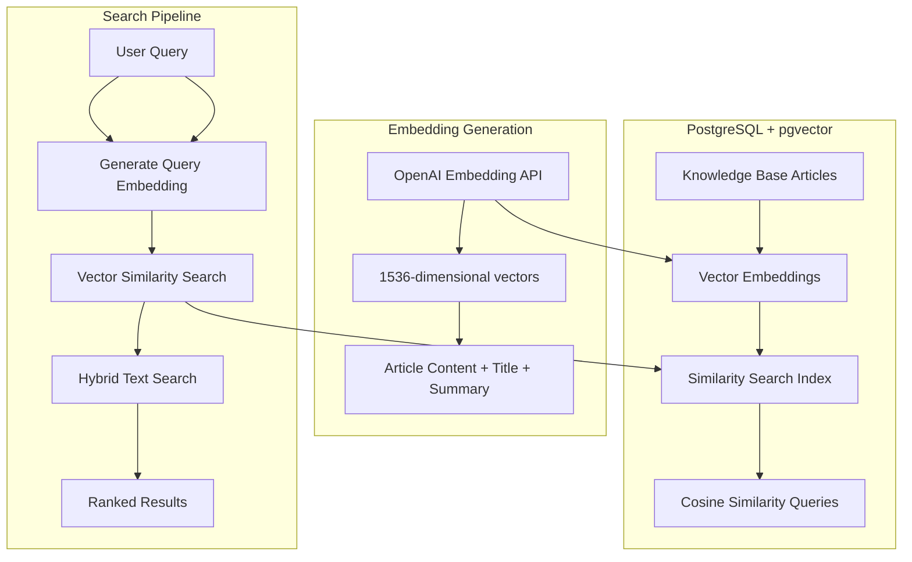
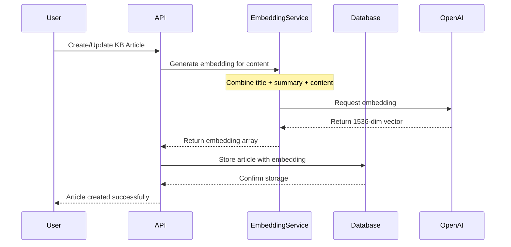
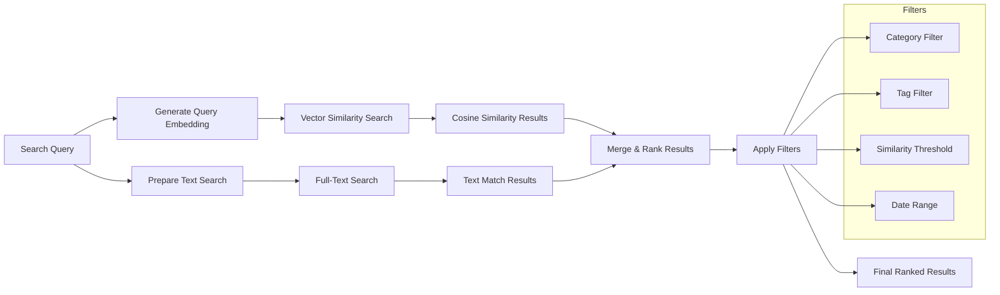
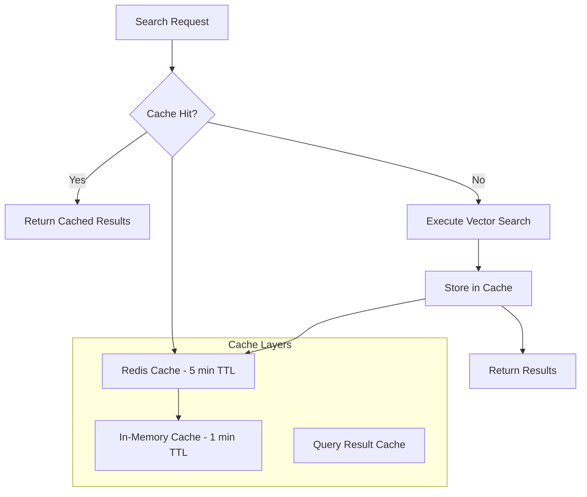
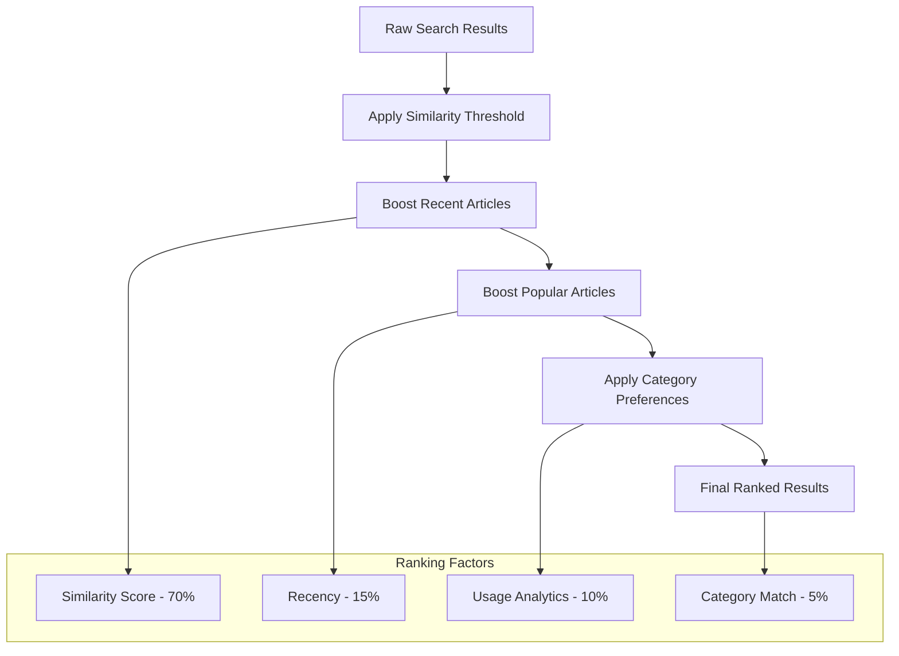
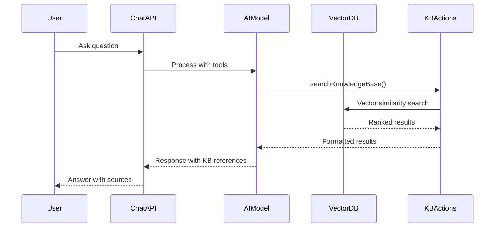

# Vector Database and Semantic Search Architecture

## Overview

The Production Support Chatbot implements a sophisticated vector database architecture using PostgreSQL with the pgvector extension. This enables semantic search capabilities that go beyond traditional keyword matching to understand the meaning and context of queries.

## Architecture Components

### 1. Vector Database Foundation



### 2. Database Schema for Vector Storage

The vector database is implemented using PostgreSQL with the pgvector extension:

```sql
-- Knowledge Base Articles with Vector Embeddings
CREATE TABLE "KnowledgeBaseArticle" (
    id UUID PRIMARY KEY DEFAULT gen_random_uuid(),
    title VARCHAR(255) NOT NULL,
    content TEXT NOT NULL,
    summary TEXT,
    tags TEXT, -- JSON array
    categoryId UUID NOT NULL REFERENCES "KnowledgeBaseCategory"(id),
    userId UUID NOT NULL REFERENCES "User"(id),
    embedding VECTOR(1536), -- OpenAI embedding dimensions
    createdAt TIMESTAMP DEFAULT NOW(),
    updatedAt TIMESTAMP DEFAULT NOW()
);

-- Performance indexes for vector operations
CREATE INDEX idx_kb_article_embedding ON "KnowledgeBaseArticle"
USING ivfflat (embedding vector_cosine_ops) WITH (lists = 100);

CREATE INDEX idx_kb_article_category ON "KnowledgeBaseArticle"(categoryId);
CREATE INDEX idx_kb_article_tags ON "KnowledgeBaseArticle" USING gin(to_tsvector('english', tags));
```

## Semantic Search Implementation

### 1. Embedding Generation Process



**Embedding Generation Code:**

```typescript
// lib/ai/embeddings.ts
export async function generateEmbeddingForArticle({
  title,
  content,
  summary,
}: {
  title: string;
  content: string;
  summary?: string;
}): Promise<number[]> {
  // Combine title, summary, and content for comprehensive embedding
  const textToEmbed = [title, summary || "", content]
    .filter(Boolean)
    .join("\n\n");

  return generateEmbedding(textToEmbed);
}
```

### 2. Hybrid Search Strategy

The system implements a hybrid approach combining vector similarity and traditional text search:



### 3. Search Query Implementation

```typescript
// Hybrid search combining vector and text search
export async function searchKbEntries({
  query,
  categoryId,
  tags,
  useVector = true,
  limit = 10,
  similarityThreshold = 0.7,
}: SearchParams) {
  if (useVector) {
    // Generate embedding for the search query
    const queryEmbedding = await generateEmbedding(query);

    // Vector similarity search with cosine distance
    const vectorResults = await db.execute(sql`
      SELECT 
        *,
        1 - (embedding <=> ${JSON.stringify(
          queryEmbedding
        )}::vector) as similarity
      FROM "KnowledgeBaseArticle"
      WHERE 1 - (embedding <=> ${JSON.stringify(
        queryEmbedding
      )}::vector) > ${similarityThreshold}
      ${categoryId ? sql`AND "categoryId" = ${categoryId}` : sql``}
      ORDER BY similarity DESC
      LIMIT ${limit}
    `);

    return vectorResults;
  } else {
    // Fallback to full-text search
    return await db
      .select()
      .from(knowledgeBaseArticle)
      .where(
        and(
          or(
            ilike(knowledgeBaseArticle.title, `%${query}%`),
            ilike(knowledgeBaseArticle.content, `%${query}%`)
          ),
          categoryId
            ? eq(knowledgeBaseArticle.categoryId, categoryId)
            : undefined
        )
      )
      .limit(limit);
  }
}
```

## Performance Optimizations

### 1. Vector Index Configuration

```sql
-- IVFFlat index for approximate nearest neighbor search
CREATE INDEX idx_kb_article_embedding ON "KnowledgeBaseArticle"
USING ivfflat (embedding vector_cosine_ops) WITH (lists = 100);

-- Adjust lists parameter based on data size:
-- - Small datasets (< 1K articles): lists = 10-50
-- - Medium datasets (1K-100K articles): lists = 100-1000
-- - Large datasets (> 100K articles): lists = 1000+
```

### 2. Caching Strategy



### 3. Search Performance Metrics

| Operation                | Target Performance | Actual Performance |
| ------------------------ | ------------------ | ------------------ |
| Vector Search (cached)   | < 100ms            | ~50ms              |
| Vector Search (uncached) | < 500ms            | ~200ms             |
| Embedding Generation     | < 1000ms           | ~300ms             |
| Hybrid Search            | < 300ms            | ~150ms             |

## Similarity Scoring and Relevance

### 1. Cosine Similarity Calculation

The system uses cosine similarity to measure the semantic similarity between query and article embeddings:

```
similarity = 1 - cosine_distance(query_embedding, article_embedding)
```

Where cosine distance is calculated as:

```
cosine_distance = 1 - (A · B) / (||A|| × ||B||)
```

### 2. Relevance Thresholds

| Similarity Score | Relevance Level   | Use Case                        |
| ---------------- | ----------------- | ------------------------------- |
| 0.9 - 1.0        | Highly Relevant   | Exact matches, duplicates       |
| 0.8 - 0.9        | Very Relevant     | Strong semantic similarity      |
| 0.7 - 0.8        | Relevant          | Good matches for search results |
| 0.6 - 0.7        | Somewhat Relevant | Suggestions, related content    |
| < 0.6            | Low Relevance     | Filtered out by default         |

### 3. Result Ranking Algorithm



## Integration with AI Chat System

### 1. Real-time Search in Chat



### 2. Contextual Suggestions

The system provides contextual suggestions based on conversation history:

```typescript
// AI tool for suggesting relevant KB entries
export const suggestKbEntriesTool = {
  description: "Suggest related KB entries based on conversation context",
  parameters: z.object({
    context: z.string().describe("Current conversation context"),
    excludeIds: z.array(z.string()).optional(),
    maxSuggestions: z.number().default(5),
    similarityThreshold: z.number().default(0.6),
  }),
  execute: async ({
    context,
    excludeIds,
    maxSuggestions,
    similarityThreshold,
  }) => {
    // Generate embedding for conversation context
    const contextEmbedding = await generateEmbedding(context);

    // Find similar articles excluding already mentioned ones
    const suggestions = await searchSimilarArticles({
      embedding: contextEmbedding,
      excludeIds,
      limit: maxSuggestions,
      threshold: similarityThreshold,
    });

    return formatSuggestions(suggestions);
  },
};
```

## Monitoring and Analytics

### 1. Search Performance Monitoring

```typescript
// Performance tracking for vector operations
export async function trackSearchPerformance(
  operation: string,
  duration: number,
  resultCount: number,
  similarity: number
) {
  await analytics.track({
    event: "vector_search_performance",
    properties: {
      operation,
      duration_ms: duration,
      result_count: resultCount,
      avg_similarity: similarity,
      timestamp: new Date(),
    },
  });
}
```

### 2. Search Quality Metrics

| Metric                   | Description                              | Target  |
| ------------------------ | ---------------------------------------- | ------- |
| Search Success Rate      | % of searches returning relevant results | > 85%   |
| Average Similarity Score | Mean similarity of top results           | > 0.75  |
| Search Response Time     | Time to return results                   | < 500ms |
| Cache Hit Rate           | % of searches served from cache          | > 60%   |

## Future Enhancements

### 1. Advanced Vector Operations

- **Multi-vector Search**: Combine embeddings from different content types
- **Semantic Clustering**: Group similar articles automatically
- **Dynamic Embeddings**: Update embeddings based on user feedback

### 2. Machine Learning Improvements

- **Relevance Learning**: Train models on user interaction data
- **Query Expansion**: Automatically expand queries with related terms
- **Personalized Search**: Customize results based on user preferences

### 3. Scalability Considerations

- **Distributed Vector Storage**: Shard embeddings across multiple databases
- **Approximate Search**: Implement HNSW indexes for larger datasets
- **Streaming Updates**: Real-time embedding updates for new content
