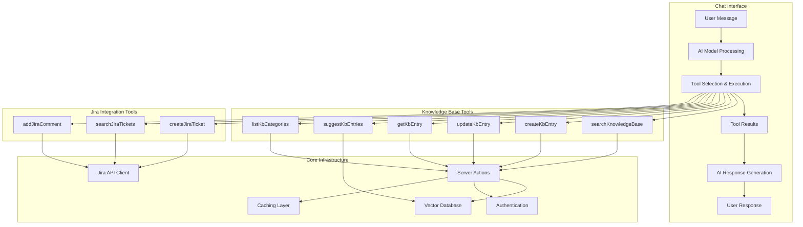
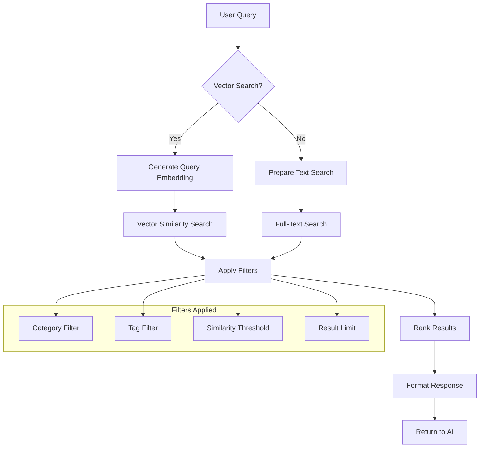
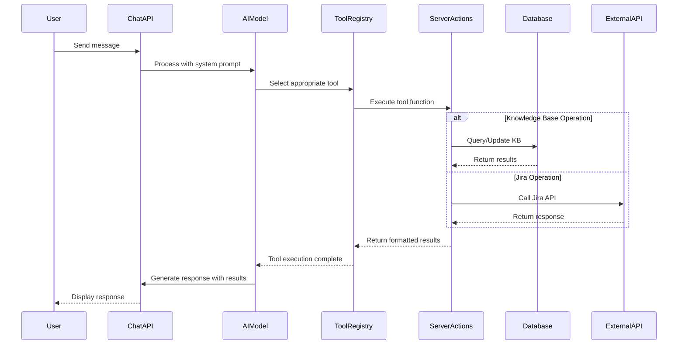
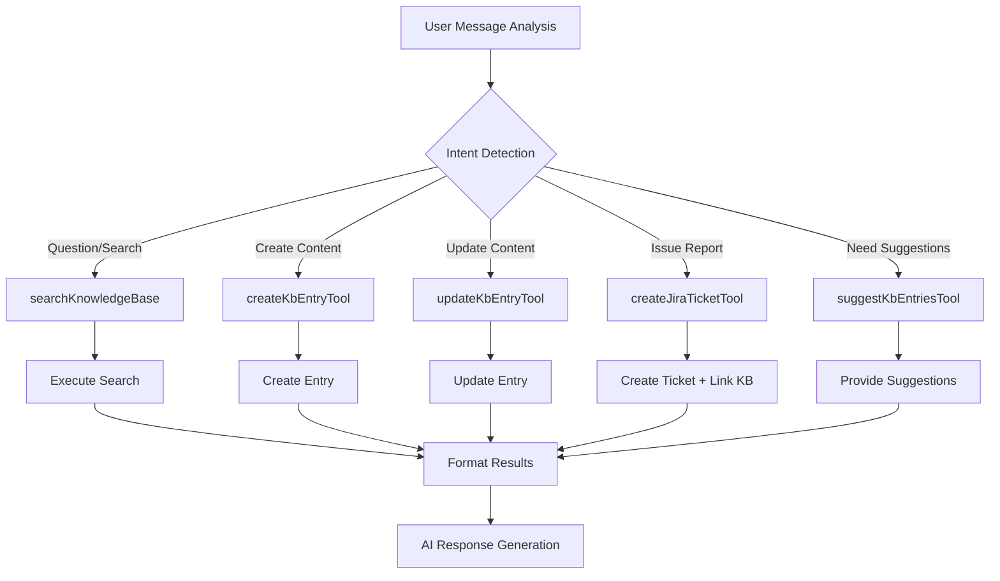
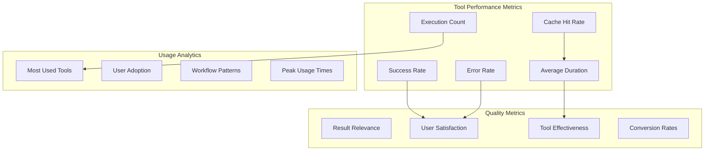

# AI Tools Architecture and Implementation

## Overview

The Production Support Chatbot implements a comprehensive set of AI tools that enable natural language interaction with the Knowledge Base and Jira systems. These tools are integrated with the Vercel AI SDK and provide seamless conversational access to production support workflows.

## AI Tools Architecture



## Tool Categories and Implementation

### 1. Knowledge Base Tools

#### Search Knowledge Base Tool

**Purpose**: Semantic search across knowledge base articles using vector similarity

```typescript
// lib/ai/tools/search-knowledge-base.ts
export const searchKnowledgeBase = {
  description:
    "Search the knowledge base using semantic similarity or text search",
  parameters: z.object({
    query: z.string().describe("Search query or question"),
    categoryId: z.string().optional().describe("Filter by category UUID"),
    tags: z.array(z.string()).optional().describe("Filter by tags"),
    useVector: z
      .boolean()
      .default(true)
      .describe("Use vector search (true) or text search (false)"),
    limit: z
      .number()
      .default(5)
      .min(1)
      .max(20)
      .describe("Maximum number of results"),
    similarityThreshold: z
      .number()
      .default(0.7)
      .min(0)
      .max(1)
      .describe("Minimum similarity score"),
  }),
  execute: async (params) => {
    const result = await searchKbEntries(params);
    return formatSearchResults(result);
  },
};
```

**Tool Flow Diagram**:



#### Create KB Entry Tool

**Purpose**: Create new knowledge base articles from conversation content

```typescript
// lib/ai/tools/create-kb-entry.ts
export const createKbEntryTool = {
  description: "Create a new knowledge base entry",
  parameters: z.object({
    title: z.string().min(1).max(255).describe("Article title"),
    content: z.string().min(1).describe("Article content in markdown"),
    summary: z
      .string()
      .optional()
      .describe("Brief summary (auto-generated if not provided)"),
    tags: z.string().optional().describe("Comma-separated tags"),
    categoryId: z.string().describe("Category UUID for the article"),
  }),
  execute: async (params) => {
    // Auto-generate summary if not provided
    if (!params.summary) {
      params.summary = await generateSummary(params.content);
    }

    const result = await createKbEntry({
      ...params,
      tags: params.tags ? params.tags.split(",").map((t) => t.trim()) : [],
    });

    return formatCreationResult(result);
  },
};
```

### 2. Jira Integration Tools

#### Create Jira Ticket Tool

**Purpose**: Create Jira tickets with automatic KB entry linking

```typescript
// lib/ai/tools/create-jira-ticket.ts
export const createJiraTicketTool = {
  description: "Create a new Jira ticket with optional KB entry linking",
  parameters: z.object({
    summary: z.string().min(1).max(255).describe("Ticket summary/title"),
    description: z.string().min(1).describe("Detailed ticket description"),
    issueType: z.enum(["Bug", "Task", "Story", "Epic"]).default("Task"),
    priority: z
      .enum(["Lowest", "Low", "Medium", "High", "Highest"])
      .default("Medium"),
    assignee: z.string().optional().describe("Assignee email or username"),
    chatId: z.string().optional().describe("Related chat conversation ID"),
    linkKbEntries: z
      .boolean()
      .default(true)
      .describe("Auto-link related KB entries"),
  }),
  execute: async (params) => {
    // Create the Jira ticket
    const ticketResult = await createJiraTicketAction(params);

    if (params.linkKbEntries && ticketResult.success) {
      // Find and link related KB entries
      const relatedEntries = await findRelatedKbEntries(params.description);
      await linkKbEntriesToTicket(ticketResult.data.id, relatedEntries);
    }

    return formatTicketResult(ticketResult);
  },
};
```

### 3. Tool Integration Flow



## Tool Registration and Configuration

### 1. Chat API Integration

```typescript
// app/(chat)/api/chat/route.ts
export async function POST(request: Request) {
  // ... authentication and setup ...

  const result = streamText({
    model: myProvider.languageModel(selectedChatModel),
    system: systemPrompt({ selectedChatModel, requestHints }),
    messages,
    maxSteps: 5,
    experimental_activeTools: [
      // Knowledge Base Tools
      "searchKnowledgeBase",
      "createKbEntryTool",
      "updateKbEntryTool",
      "getKbEntryTool",
      "suggestKbEntriesTool",
      "listKbCategoriesTool",

      // Jira Integration Tools
      "createJiraTicketTool",
      "searchJiraTicketsTool",
      "addJiraCommentTool",

      // Core Tools
      "getWeather",
      "createDocument",
      "updateDocument",
      "requestSuggestions",
    ],
    tools: {
      // KB Tools
      searchKnowledgeBase,
      createKbEntryTool,
      updateKbEntryTool,
      getKbEntryTool,
      suggestKbEntriesTool,
      listKbCategoriesTool,

      // Jira Tools
      createJiraTicketTool,
      searchJiraTicketsTool,
      addJiraCommentTool,

      // Core Tools
      getWeather,
      createDocument: createDocument({ session, dataStream }),
      updateDocument: updateDocument({ session, dataStream }),
      requestSuggestions: requestSuggestions({ session, dataStream }),
    },
  });
}
```

### 2. System Prompt Integration

```typescript
// lib/ai/prompts.ts - Enhanced with KB and Jira guidance
export function systemPrompt({
  selectedChatModel,
  requestHints,
}: SystemPromptOptions) {
  return `You are a helpful AI assistant for production support with access to:

## Knowledge Base Tools
- searchKnowledgeBase: Find relevant articles using semantic search
- createKbEntryTool: Create new knowledge base entries
- updateKbEntryTool: Update existing articles
- getKbEntryTool: Retrieve specific articles by ID
- suggestKbEntriesTool: Suggest related articles based on context
- listKbCategoriesTool: List available categories

## Jira Integration Tools
- createJiraTicketTool: Create tickets with automatic KB linking
- searchJiraTicketsTool: Search existing tickets
- addJiraCommentTool: Add comments to tickets

## Best Practices
1. Always search the knowledge base first before creating new content
2. When creating KB entries, use clear titles and comprehensive content
3. Link related KB entries to Jira tickets automatically
4. Suggest relevant articles proactively during conversations
5. Use semantic search to find conceptually similar content

## Tool Usage Guidelines
- Use vector search (default) for semantic similarity
- Fall back to text search for exact keyword matches
- Apply appropriate similarity thresholds (0.7+ for search, 0.6+ for suggestions)
- Always validate user permissions before updates
- Provide clear feedback on tool execution results`;
}
```

## Advanced Tool Features

### 1. Contextual Tool Selection



### 2. Multi-Tool Workflows

**Example: Issue Resolution Workflow**

```typescript
// Automatic workflow combining multiple tools
async function handleIssueResolution(userMessage: string) {
  // 1. Search for existing solutions
  const searchResults = await searchKnowledgeBase({
    query: userMessage,
    useVector: true,
    limit: 5,
  });

  if (searchResults.length > 0) {
    // 2. Suggest related articles
    const suggestions = await suggestKbEntriesTool({
      context: userMessage,
      maxSuggestions: 3,
    });

    return {
      type: "solution_found",
      articles: searchResults,
      suggestions: suggestions,
    };
  } else {
    // 3. Create Jira ticket for new issue
    const ticket = await createJiraTicketTool({
      summary: extractSummary(userMessage),
      description: userMessage,
      issueType: "Bug",
      linkKbEntries: true,
    });

    return {
      type: "ticket_created",
      ticket: ticket,
    };
  }
}
```

### 3. Error Handling and Fallbacks

```typescript
// Robust error handling across all tools
export async function executeToolWithFallback(
  toolName: string,
  params: any,
  fallbackStrategy: "retry" | "alternative" | "graceful"
) {
  try {
    return await executeTool(toolName, params);
  } catch (error) {
    logger.error(`Tool execution failed: ${toolName}`, { error, params });

    switch (fallbackStrategy) {
      case "retry":
        // Retry with exponential backoff
        return await retryWithBackoff(() => executeTool(toolName, params));

      case "alternative":
        // Use alternative tool (e.g., text search instead of vector search)
        return await executeAlternativeTool(toolName, params);

      case "graceful":
        // Return user-friendly error message
        return {
          success: false,
          error:
            "The requested operation is temporarily unavailable. Please try again later.",
          fallback: true,
        };
    }
  }
}
```

## Performance Optimization

### 1. Tool Execution Caching

```typescript
// Cache tool results for improved performance
export class ToolCache {
  private cache = new Map<
    string,
    { result: any; timestamp: number; ttl: number }
  >();

  async executeWithCache(
    toolName: string,
    params: any,
    ttl: number = 300000 // 5 minutes default
  ) {
    const cacheKey = this.generateCacheKey(toolName, params);
    const cached = this.cache.get(cacheKey);

    if (cached && Date.now() - cached.timestamp < cached.ttl) {
      return cached.result;
    }

    const result = await this.executeTool(toolName, params);
    this.cache.set(cacheKey, {
      result,
      timestamp: Date.now(),
      ttl,
    });

    return result;
  }
}
```

### 2. Parallel Tool Execution

```typescript
// Execute multiple tools in parallel when possible
export async function executeToolsInParallel(toolRequests: ToolRequest[]) {
  const independentTools = toolRequests.filter((req) => !req.dependsOn);
  const dependentTools = toolRequests.filter((req) => req.dependsOn);

  // Execute independent tools in parallel
  const independentResults = await Promise.allSettled(
    independentTools.map((req) => executeTool(req.name, req.params))
  );

  // Execute dependent tools sequentially
  const dependentResults = [];
  for (const tool of dependentTools) {
    const dependencies = independentResults
      .filter((result) => tool.dependsOn.includes(result.name))
      .map((result) => result.value);

    const result = await executeTool(tool.name, {
      ...tool.params,
      dependencies,
    });
    dependentResults.push(result);
  }

  return [...independentResults, ...dependentResults];
}
```

## Monitoring and Analytics

### 1. Tool Usage Analytics

```typescript
// Track tool usage and performance
export async function trackToolUsage(
  toolName: string,
  params: any,
  result: any,
  duration: number,
  userId?: string
) {
  await analytics.track({
    event: "ai_tool_execution",
    properties: {
      tool_name: toolName,
      success: result.success,
      duration_ms: duration,
      user_id: userId,
      params_hash: hashParams(params),
      result_size: JSON.stringify(result).length,
      timestamp: new Date(),
    },
  });
}
```

### 2. Tool Performance Dashboard



## Future Enhancements

### 1. Intelligent Tool Orchestration

- **Auto-workflow Generation**: Create multi-step workflows automatically
- **Context-aware Tool Selection**: Choose tools based on conversation history
- **Predictive Tool Loading**: Pre-load likely tools based on patterns

### 2. Advanced AI Capabilities

- **Tool Result Learning**: Improve tool selection based on result quality
- **Custom Tool Generation**: Create specialized tools for specific use cases
- **Cross-tool Data Flow**: Enable seamless data passing between tools

### 3. Integration Expansions

- **Additional External APIs**: Slack, Teams, ServiceNow integration
- **Custom Tool Framework**: Allow users to create custom tools
- **Workflow Automation**: Trigger tool sequences based on events
