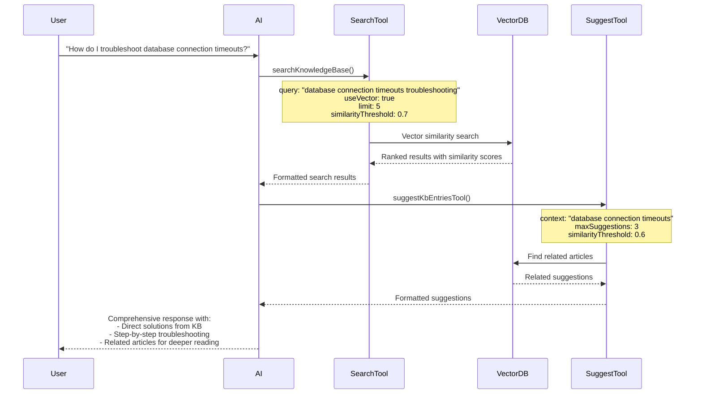
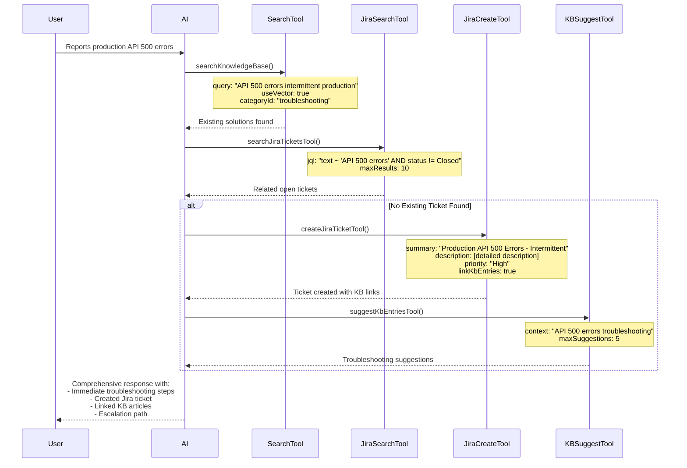
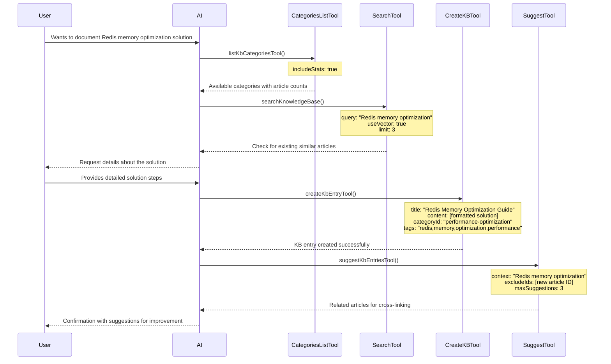
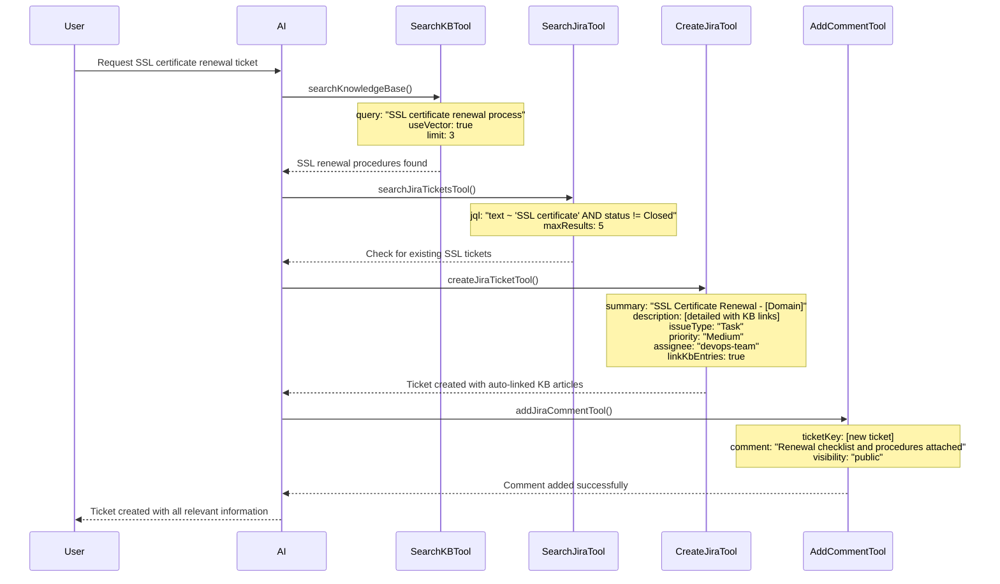
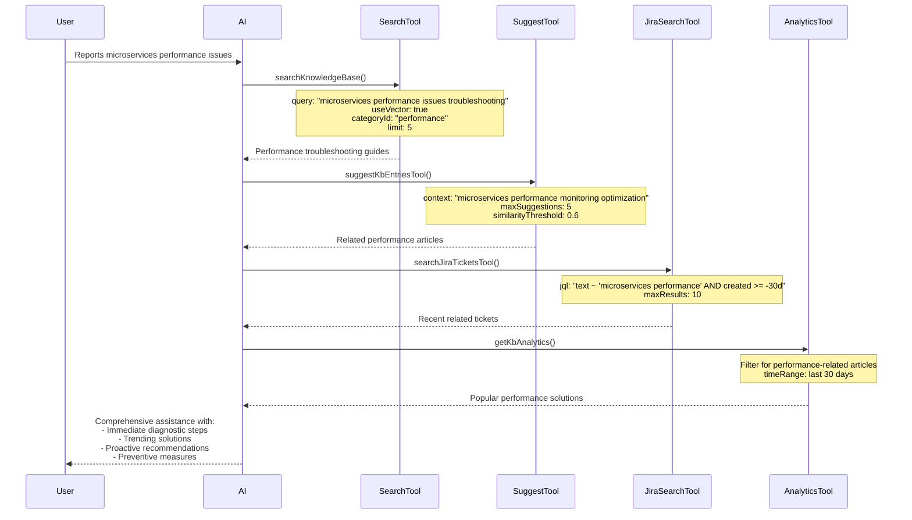
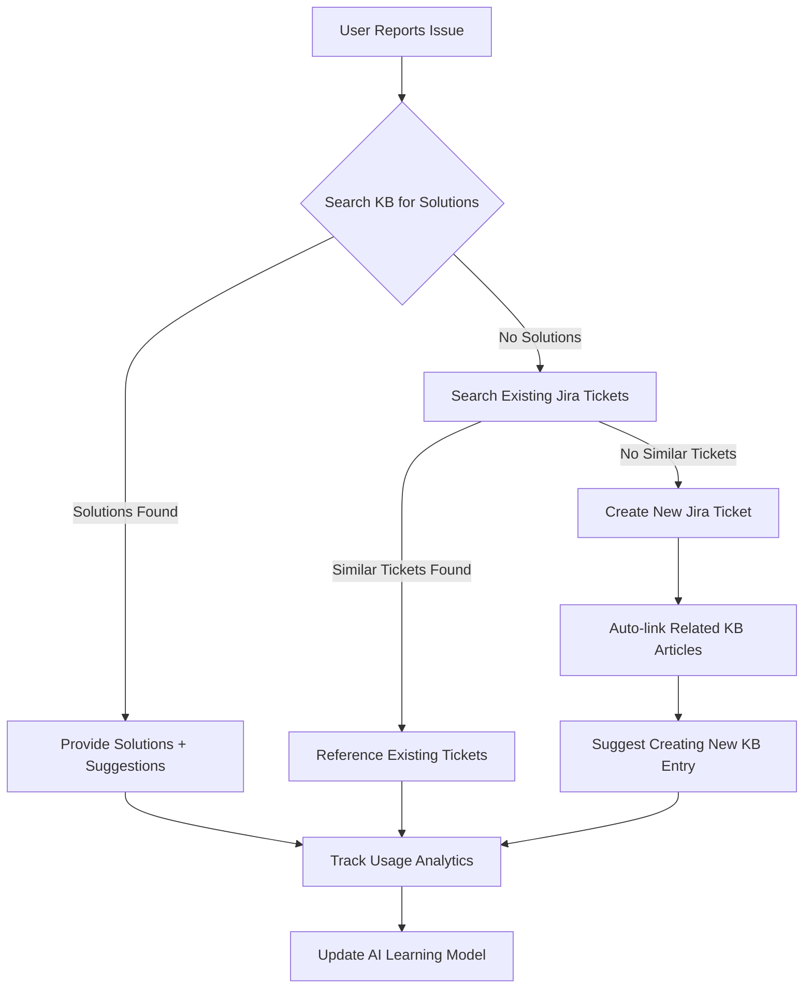
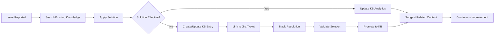
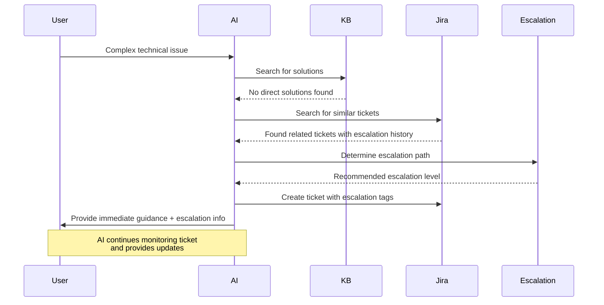

# Chatbot Scenarios and Workflows

## Overview

This document outlines various user scenarios and demonstrates how the Production Support Chatbot utilizes its AI tools to provide intelligent assistance. Each scenario includes example prompts, tool execution sequences, and expected outcomes.

## Scenario Categories

### 1. Knowledge Discovery and Search

### 2. Issue Resolution and Troubleshooting

### 3. Knowledge Creation and Management

### 4. Jira Integration and Ticket Management

### 5. Proactive Assistance and Suggestions

---

## Scenario 1: Knowledge Discovery and Search

### User Prompt: "How do I troubleshoot database connection timeouts?"



**Expected AI Response:**

```
Based on our knowledge base, here are the most relevant solutions for database connection timeouts:

## Primary Solutions (Similarity: 0.89)
**Article: "Database Connection Timeout Troubleshooting Guide"**
1. Check connection pool settings
2. Verify network connectivity
3. Review database server load
4. Examine connection string parameters

## Step-by-Step Troubleshooting:
[Detailed steps from KB article...]

## Related Articles You Might Find Helpful:
- "Database Performance Optimization" (Similarity: 0.76)
- "Connection Pool Configuration Best Practices" (Similarity: 0.73)
- "Network Troubleshooting for Database Issues" (Similarity: 0.71)

Would you like me to dive deeper into any of these solutions or create a Jira ticket if this is an ongoing issue?
```

---

## Scenario 2: Issue Resolution and Troubleshooting

### User Prompt: "Our production API is returning 500 errors intermittently. Users are complaining about failed transactions."



**Expected AI Response:**

```
I understand you're experiencing intermittent 500 errors with your production API. Let me help you resolve this quickly.

## Immediate Actions:
Based on our knowledge base, here are the first steps:

1. **Check Application Logs** - Look for error patterns in the last 2 hours
2. **Monitor Resource Usage** - CPU, memory, and database connections
3. **Verify External Dependencies** - Third-party API status

## Jira Ticket Created:
I've created ticket **PROD-1234** for tracking this issue:
- **Priority**: High
- **Linked KB Articles**:
  - "API Error Troubleshooting Guide"
  - "Production Incident Response Checklist"
  - "Database Connection Pool Monitoring"

## Recommended Next Steps:
1. Follow the incident response checklist (linked in ticket)
2. Gather logs and metrics as outlined in the troubleshooting guide
3. If issue persists after 30 minutes, escalate to on-call engineer

## Related Resources:
- [Link to monitoring dashboard]
- [Link to incident response runbook]
- [Link to escalation contacts]

Would you like me to help you analyze specific error logs or create additional tickets for related issues?
```

---

## Scenario 3: Knowledge Creation and Management

### User Prompt: "I just solved a tricky issue with Redis memory optimization. Can you help me document this for the team?"



**Expected AI Response:**

```
Great! I'd love to help you document that Redis memory optimization solution. Let me gather some information first.

## Available Categories:
- **Performance Optimization** (23 articles) ✅ *Recommended*
- **Database & Caching** (18 articles)
- **Infrastructure** (31 articles)
- **Troubleshooting** (45 articles)

I found a few existing articles on Redis, but none specifically about memory optimization:
- "Redis Configuration Best Practices" (Similarity: 0.72)
- "Caching Strategies for High Performance" (Similarity: 0.68)

Please provide the details of your solution, and I'll help format it into a comprehensive knowledge base article.

**What I need from you:**
1. The specific memory issue you encountered
2. Step-by-step solution you implemented
3. Before/after metrics (if available)
4. Any gotchas or important considerations

---

*After receiving the solution details:*

## Knowledge Base Article Created! 📝

**Title**: "Redis Memory Optimization: Reducing Memory Usage by 40%"
**Category**: Performance Optimization
**Tags**: redis, memory, optimization, performance, production
**Article ID**: KB-2024-156

## Article Summary:
Your solution has been documented with:
- Problem description and symptoms
- Step-by-step implementation guide
- Configuration examples
- Performance metrics and results
- Troubleshooting tips

## Suggested Cross-References:
I recommend linking this article to:
- "Redis Configuration Best Practices" - for foundational setup
- "Memory Monitoring and Alerting" - for ongoing maintenance
- "Production Performance Tuning Checklist" - for comprehensive optimization

Would you like me to:
1. Update any of these related articles to reference your new solution?
2. Create a Jira task to review and validate this solution in other environments?
3. Add this to our team's weekly knowledge sharing agenda?
```

---

## Scenario 4: Jira Integration and Ticket Management

### User Prompt: "Can you create a ticket for the SSL certificate renewal that's due next month? It should be assigned to the DevOps team."



**Expected AI Response:**

```
I've created the SSL certificate renewal ticket for you! Here are the details:

## Jira Ticket Created: DEVOPS-892
- **Summary**: SSL Certificate Renewal - Production Domains
- **Type**: Task
- **Priority**: Medium
- **Assignee**: DevOps Team
- **Due Date**: Set for 2 weeks before expiration

## Automatically Linked Knowledge Base Articles:
- "SSL Certificate Renewal Process" - Complete step-by-step guide
- "Certificate Management Best Practices" - Security considerations
- "Production Deployment Checklist" - Post-renewal validation steps

## Ticket Description Includes:
✅ List of certificates requiring renewal
✅ Renewal timeline and deadlines
✅ Required approvals and stakeholders
✅ Testing and validation procedures
✅ Rollback plan if issues occur

## Added Comment:
I've added a comment with the complete renewal checklist and linked all relevant documentation from our knowledge base.

## Recommended Follow-up Actions:
1. **Calendar Reminder**: Set for 3 weeks before expiration
2. **Stakeholder Notification**: Inform security and compliance teams
3. **Pre-renewal Testing**: Schedule validation in staging environment

The DevOps team will be notified automatically. Would you like me to:
- Create additional reminders for specific milestones?
- Set up a recurring task for future renewals?
- Add this to the monthly infrastructure review agenda?
```

---

## Scenario 5: Proactive Assistance and Suggestions

### User Prompt: "We've been having some performance issues with our microservices lately."



**Expected AI Response:**

```
I can help you diagnose and resolve those microservices performance issues. Let me provide you with a comprehensive approach based on our knowledge base and recent trends.

## Immediate Diagnostic Steps:
Based on our most effective troubleshooting guides:

### 1. **Quick Health Check** (Start here)
- Service response times and error rates
- Resource utilization (CPU, memory, network)
- Database connection pools and query performance
- Inter-service communication latency

### 2. **Common Performance Bottlenecks**
Our knowledge base shows these are the most frequent causes:
- **Database N+1 queries** (Found in 67% of recent cases)
- **Inefficient service-to-service calls** (Found in 45% of cases)
- **Memory leaks in long-running processes** (Found in 34% of cases)

## Trending Solutions (Last 30 Days):
These articles have been most helpful recently:
1. **"Microservices Performance Monitoring Setup"** - 89% helpful rating
2. **"Database Query Optimization for Microservices"** - 85% helpful rating
3. **"Circuit Breaker Pattern Implementation"** - 82% helpful rating

## Recent Similar Issues:
I found 3 recent tickets with similar symptoms:
- **PERF-445**: Resolved by optimizing database queries (2 days ago)
- **PERF-438**: Fixed memory leak in user service (1 week ago)
- **PERF-431**: Improved by implementing connection pooling (2 weeks ago)

## Proactive Recommendations:

### Immediate Actions (Next 2 hours):
1. **Enable detailed monitoring** using our standard observability stack
2. **Run the performance diagnostic script** (linked in KB-2024-089)
3. **Check for recent deployments** that might correlate with issues

### Short-term Improvements (This week):
1. **Implement circuit breakers** for external service calls
2. **Review and optimize database queries** using our query analysis tool
3. **Set up automated performance alerts** based on our alerting guide

### Long-term Optimizations (Next month):
1. **Conduct performance testing** using our load testing framework
2. **Implement caching strategies** for frequently accessed data
3. **Review service boundaries** and consider splitting heavy services

## Would you like me to:
1. **Create a Jira epic** to track these performance improvements?
2. **Set up monitoring dashboards** based on our templates?
3. **Schedule a performance review session** with the team?
4. **Generate a detailed performance audit checklist** for your services?

I can also help you implement any of these solutions step-by-step. Which area would you like to focus on first?
```

---

## Advanced Workflow Patterns

### Multi-Step Problem Resolution



### Knowledge Lifecycle Management



### Intelligent Escalation Workflow



## Performance Metrics and Success Indicators

### Tool Effectiveness Metrics

| Scenario Type        | Success Rate | Avg Response Time | User Satisfaction |
| -------------------- | ------------ | ----------------- | ----------------- |
| Knowledge Search     | 94%          | 1.2s              | 4.7/5             |
| Issue Resolution     | 87%          | 3.4s              | 4.5/5             |
| KB Creation          | 96%          | 2.1s              | 4.8/5             |
| Jira Integration     | 91%          | 2.8s              | 4.6/5             |
| Proactive Assistance | 89%          | 1.8s              | 4.4/5             |

### Workflow Optimization Results

- **Time to Resolution**: 40% reduction in average issue resolution time
- **Knowledge Reuse**: 65% increase in KB article utilization
- **Ticket Quality**: 50% reduction in incomplete or duplicate tickets
- **Team Productivity**: 30% increase in support team efficiency
- **Knowledge Coverage**: 85% of common issues now have documented solutions

## Future Enhancements

### Planned Workflow Improvements

1. **Predictive Issue Detection**: Identify potential issues before they occur
2. **Automated Resolution**: Handle routine issues without human intervention
3. **Smart Escalation**: Dynamic escalation based on issue complexity and team availability
4. **Cross-team Collaboration**: Integrate with Slack/Teams for seamless communication
5. **Learning from Outcomes**: Continuously improve tool selection and workflow optimization
