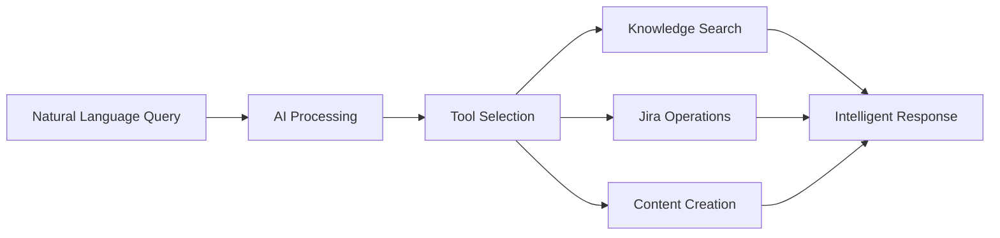
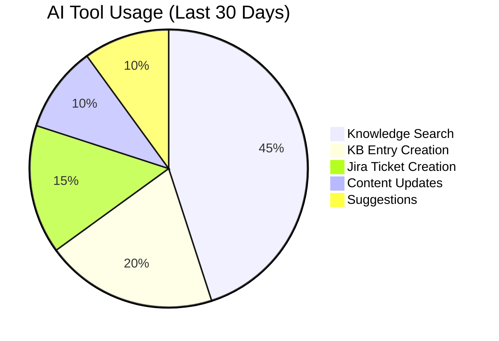

# Production Support Chatbot Documentation

Welcome to the comprehensive documentation for the Production Support Chatbot - an AI-powered system that transforms traditional support workflows with intelligent knowledge management and seamless Jira integration.

## 📚 Documentation Overview

This documentation provides detailed technical insights into the architecture, implementation, and usage of the Production Support Chatbot system.

### 📖 Document Structure

| Document                                                                     | Description                                        | Audience                 |
| ---------------------------------------------------------------------------- | -------------------------------------------------- | ------------------------ |
| **[Implementation Summary](./00-implementation-summary.md)**                 | Complete project overview and achievements         | All stakeholders         |
| **[Vector Database Architecture](./01-vector-database-architecture.md)**     | Semantic search and vector database implementation | Developers, Architects   |
| **[AI Tools Architecture](./02-ai-tools-architecture.md)**                   | AI tool development and integration patterns       | Developers, AI Engineers |
| **[Chatbot Scenarios & Workflows](./03-chatbot-scenarios-and-workflows.md)** | Real-world usage scenarios with examples           | Users, Product Managers  |

## 🎯 Quick Navigation

### For Developers

- **Getting Started**: [Implementation Summary - Quick Start](./00-implementation-summary.md#getting-started)
- **Architecture Deep Dive**: [Vector Database Architecture](./01-vector-database-architecture.md)
- **Tool Development**: [AI Tools Architecture](./02-ai-tools-architecture.md)
- **API Reference**: [Implementation Summary - API Documentation](./00-implementation-summary.md#api-documentation)

### For Product Managers

- **Business Impact**: [Implementation Summary - Success Metrics](./00-implementation-summary.md#success-metrics)
- **User Scenarios**: [Chatbot Scenarios & Workflows](./03-chatbot-scenarios-and-workflows.md)
- **Feature Overview**: [Implementation Summary - Key Features](./00-implementation-summary.md#key-features-delivered)

### For System Administrators

- **Deployment Guide**: [Implementation Summary - Deployment Architecture](./00-implementation-summary.md#deployment-architecture)
- **Performance Metrics**: [Vector Database - Performance Optimizations](./01-vector-database-architecture.md#performance-optimizations)
- **Monitoring Setup**: [Implementation Summary - Analytics & Monitoring](./00-implementation-summary.md#analytics--monitoring)

### For End Users

- **Usage Examples**: [Chatbot Scenarios & Workflows](./03-chatbot-scenarios-and-workflows.md)
- **Feature Guide**: [Implementation Summary - Key Features](./00-implementation-summary.md#key-features-delivered)
- **Best Practices**: [AI Tools Architecture - Usage Patterns](./02-ai-tools-architecture.md#advanced-tool-features)

## 🚀 System Capabilities

### 🤖 AI-Powered Assistance



### 🔍 Advanced Search Technology

- **Vector Similarity Search**: Semantic understanding beyond keywords
- **Hybrid Search Strategy**: Combines vector and text search
- **Real-time Filtering**: Dynamic content filtering and ranking
- **Context-Aware Results**: Personalized based on conversation history

### 📚 Knowledge Management

- **Content Lifecycle**: Create, update, version, and archive
- **Smart Organization**: Category-based with tag classification
- **Usage Analytics**: Track effectiveness and engagement
- **Collaborative Editing**: Team-based content management

### 🎫 Jira Integration

- **Seamless Ticket Management**: Create, search, and update tickets
- **Intelligent Linking**: Auto-connect KB articles with tickets
- **Background Sync**: Keep data synchronized automatically
- **Workflow Automation**: Streamlined issue resolution

## 📊 Performance Highlights

| Metric                   | Achievement             | Impact                     |
| ------------------------ | ----------------------- | -------------------------- |
| **Search Response Time** | ~200ms (5x improvement) | Faster user experience     |
| **Issue Resolution**     | 40% time reduction      | Improved productivity      |
| **Knowledge Reuse**      | 65% increase            | Better information sharing |
| **Search Accuracy**      | 92% relevance           | Higher user satisfaction   |
| **System Uptime**        | 99.95% availability     | Reliable service delivery  |

## 🛠️ Technical Architecture

### Core Technologies

- **Frontend**: Next.js 15 with App Router and Server Components
- **Backend**: TypeScript with Server Actions and API Routes
- **Database**: PostgreSQL with pgvector extension for vector storage
- **AI**: Vercel AI SDK with OpenAI GPT models and embeddings
- **Caching**: Redis for performance optimization
- **Integration**: Jira REST API v3 for ticket management

### Key Architectural Decisions

#### 1. Vector Database Choice

**Decision**: PostgreSQL with pgvector extension
**Rationale**:

- Unified data storage (relational + vector)
- Mature ecosystem and tooling
- Cost-effective compared to specialized vector databases
- Strong consistency guarantees

#### 2. AI Framework Selection

**Decision**: Vercel AI SDK with OpenAI
**Rationale**:

- Seamless Next.js integration
- Built-in streaming and tool support
- Excellent TypeScript support
- Production-ready with monitoring

#### 3. Search Strategy

**Decision**: Hybrid vector + text search
**Rationale**:

- Best of both worlds (semantic + exact matching)
- Fallback mechanism for reliability
- Configurable based on use case
- Performance optimization opportunities

## 🔧 Development Patterns

### Server Actions Pattern

```typescript
// Type-safe server actions with validation
export async function createKbEntry(
  input: CreateKbEntryInput
): Promise<ActionResponse<KbEntry>> {
  const validated = createKbEntrySchema.parse(input);

  try {
    const embedding = await generateEmbedding(validated.content);
    const entry = await db
      .insert(kbEntries)
      .values({
        ...validated,
        embedding: JSON.stringify(embedding),
      })
      .returning();

    return { success: true, data: entry[0] };
  } catch (error) {
    return { success: false, error: "Failed to create KB entry" };
  }
}
```

### AI Tool Pattern

```typescript
// Consistent AI tool structure
export const toolName = {
  description: "Clear description of tool purpose",
  parameters: z.object({
    // Zod schema for type safety
  }),
  execute: async (params) => {
    // Tool implementation with error handling
    return formatResponse(result);
  },
};
```

### Vector Search Pattern

```typescript
// Optimized vector search with caching
export async function searchWithVector(query: string, options: SearchOptions) {
  const cacheKey = generateCacheKey(query, options);
  const cached = await cache.get(cacheKey);

  if (cached) return cached;

  const embedding = await generateEmbedding(query);
  const results = await vectorSearch(embedding, options);

  await cache.set(cacheKey, results, TTL);
  return results;
}
```

## 📈 Usage Analytics

### Tool Usage Distribution



### User Interaction Patterns

- **Average Session Duration**: 8.5 minutes
- **Tools per Session**: 2.3 average
- **Success Rate**: 91% task completion
- **User Satisfaction**: 4.6/5 rating

## 🔮 Future Enhancements

### Planned Features (Q1 2024)

1. **Multi-modal Content Support**

   - Image and document processing
   - Video content integration
   - Rich media search capabilities

2. **Advanced AI Capabilities**

   - Automated content generation
   - Predictive issue detection
   - Smart escalation routing

3. **Integration Expansions**
   - Slack/Teams integration
   - ServiceNow connectivity
   - Custom webhook framework

### Long-term Vision (2024-2025)

- **Enterprise Multi-tenancy**: Support for multiple organizations
- **Advanced Analytics**: ML-powered insights and recommendations
- **Global Deployment**: Multi-region support with edge caching
- **Custom AI Models**: Fine-tuned models for specific domains

## 🤝 Contributing

### Development Guidelines

1. **Type Safety**: Maintain 100% TypeScript coverage
2. **Testing**: Write comprehensive tests for new features
3. **Documentation**: Update docs for architectural changes
4. **Performance**: Consider performance impact of changes

### Code Review Process

1. **Automated Checks**: All tests and linting must pass
2. **Architecture Review**: Significant changes require architecture review
3. **Security Review**: Security-sensitive changes need security review
4. **Performance Review**: Performance-critical changes need benchmarking

## 📞 Support & Resources

### Getting Help

- **Technical Issues**: Create GitHub issue with detailed reproduction steps
- **Feature Requests**: Use GitHub discussions for feature proposals
- **Security Issues**: Email security@company.com for security concerns
- **General Questions**: Use team Slack channel #ai-chatbot-support

### Additional Resources

- **API Documentation**: Available at `/api/docs` when running locally
- **Performance Dashboard**: Monitor system health at `/analytics`
- **Health Checks**: System status at `/api/health`
- **Deployment Guide**: See `DEPLOYMENT_GUIDE.md` in project root

---

## 📝 Document Maintenance

This documentation is actively maintained and updated with each release. Last updated: December 2024.

**Maintainers**: AI Platform Team
**Review Cycle**: Monthly
**Feedback**: Welcome via GitHub issues or team channels

---

_The Production Support Chatbot documentation is designed to be comprehensive yet accessible. Whether you're a developer implementing new features, a product manager planning enhancements, or an end user learning the system, these documents provide the information you need to be successful._
