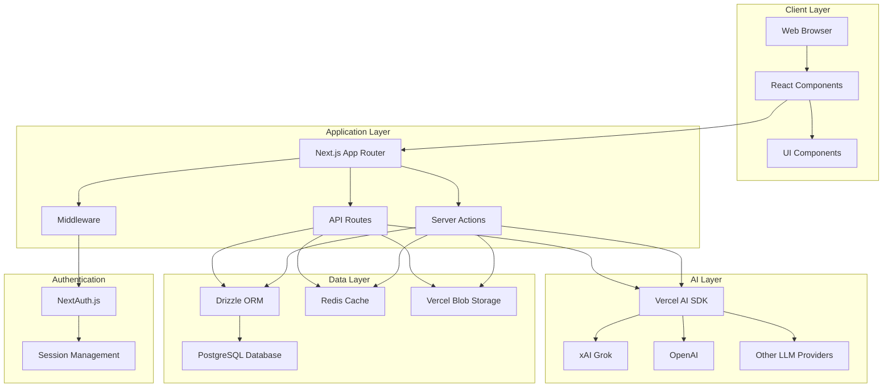
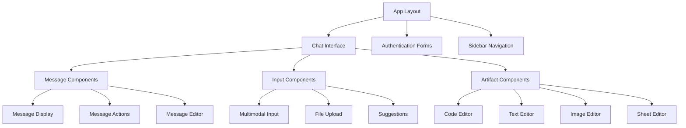
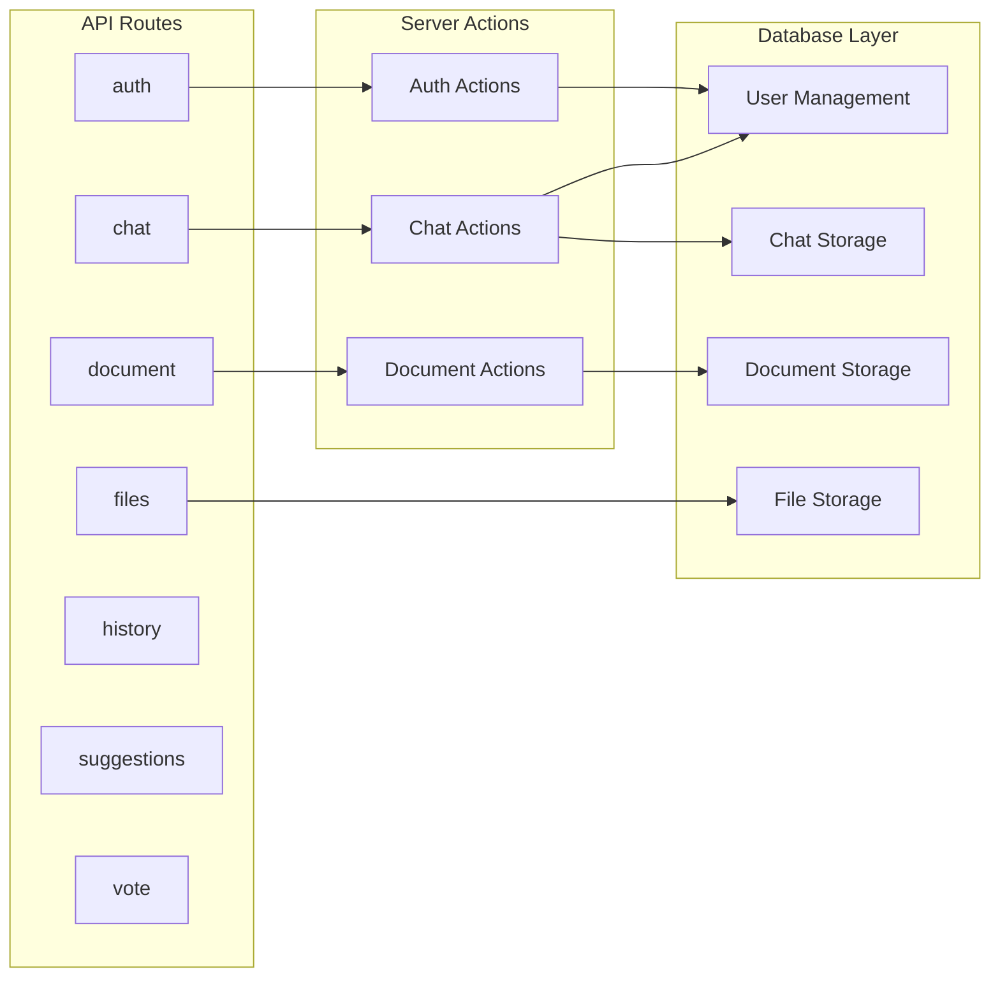
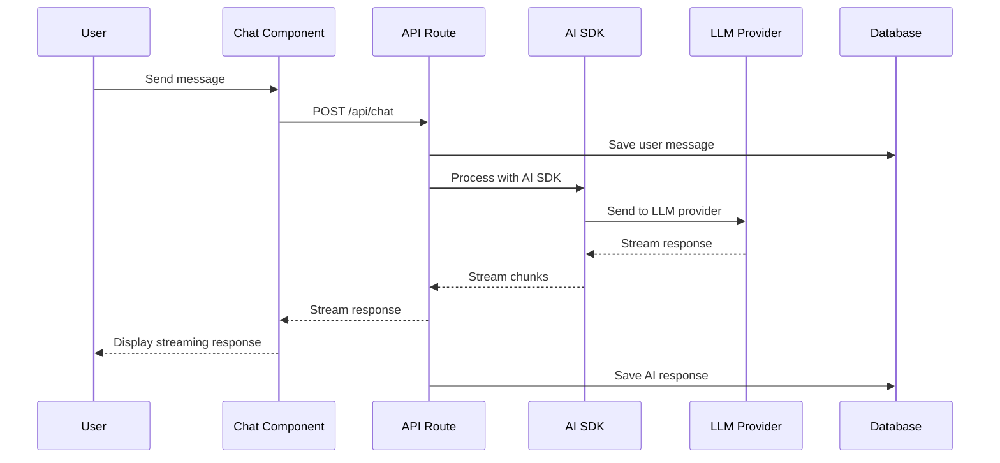
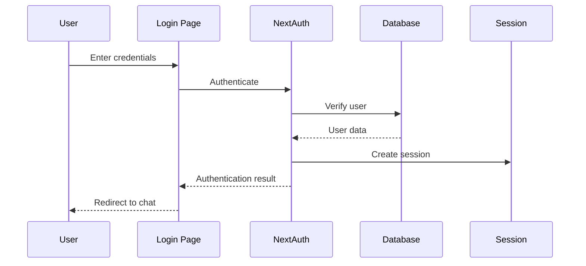
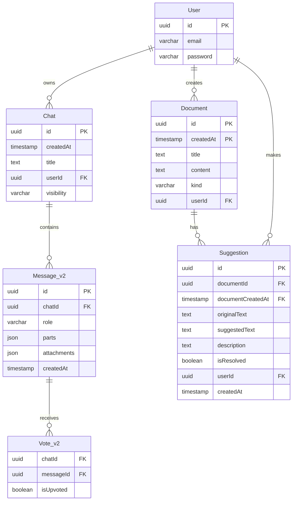
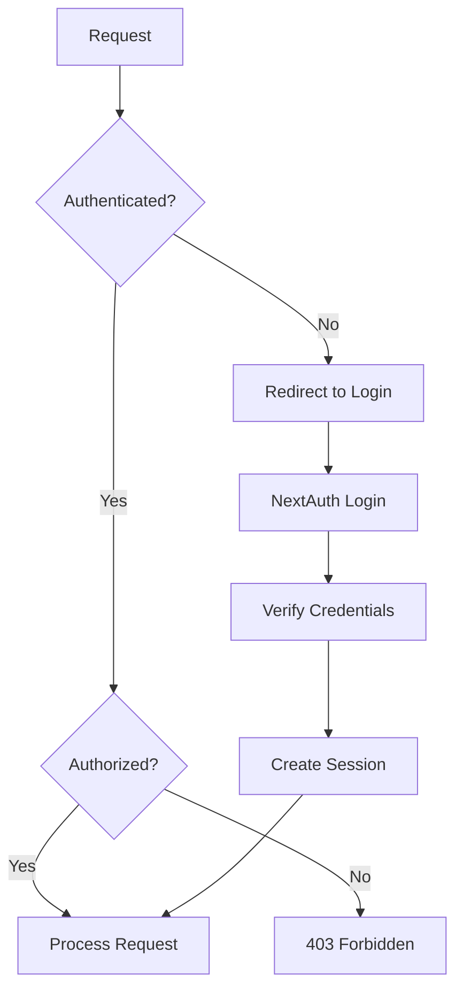
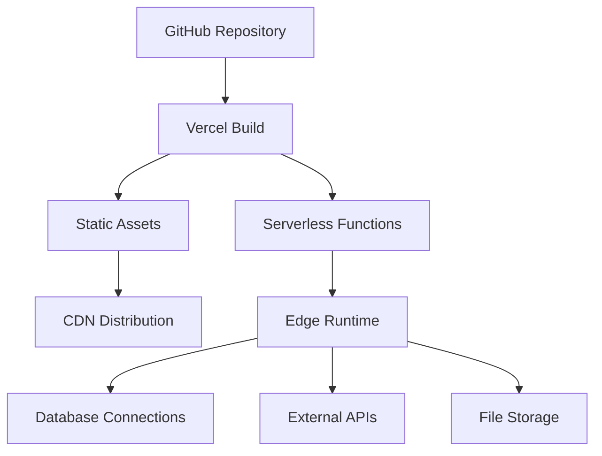

# Project Architecture

## Overview

The AI Chatbot application follows a modern full-stack architecture built on Next.js with clear separation of concerns. This document explains the high-level architecture, data flow, and key components that make up the system.

## High-Level Architecture

## Component Architecture

### Frontend Components

The frontend is organized into several key component categories:

### Backend Architecture

The backend follows Next.js App Router patterns with clear API organization:

## Data Flow

### Chat Message Flow

### Authentication Flow

## Database Schema

The application uses a PostgreSQL database with the following main entities:

## Key Architectural Patterns

### 1. Server Components & Client Components

The application leverages React Server Components for optimal performance:

- **Server Components**: Handle data fetching, AI processing, and database operations
- **Client Components**: Manage user interactions, real-time updates, and client-side state

### 2. Streaming Responses

AI responses are streamed in real-time using:

- Server-Sent Events (SSE) for real-time communication
- React's `useEffect` and `useState` for handling streaming data
- Optimistic UI updates for better user experience

### 3. Middleware Integration

Next.js middleware handles:

- Authentication checks
- Route protection
- Request/response modification
- Logging and analytics

### 4. Type Safety

The entire application is built with TypeScript:

- Database schema types generated by Drizzle
- API route types with Zod validation
- Component prop types with React TypeScript
- AI SDK types for structured responses

## Security Architecture

### Authentication & Authorization

### Data Protection

- **Environment Variables**: Sensitive data stored securely
- **Database Security**: Connection pooling and query parameterization
- **File Upload Security**: Type validation and size limits
- **CORS Configuration**: Proper cross-origin resource sharing setup

## Performance Optimizations

### 1. Database Optimizations

- Connection pooling with PostgreSQL
- Indexed queries for fast lookups
- Efficient pagination for chat history

### 2. Caching Strategy

- Redis for session storage
- Static asset caching
- API response caching where appropriate

### 3. Frontend Optimizations

- Code splitting with Next.js
- Image optimization
- Lazy loading of components
- Optimistic UI updates

## Deployment Architecture

The application is designed for deployment on Vercel:

## Next Steps

Now that you understand the architecture, let's explore the [Directory Structure](./03-directory-structure.md) to see how the code is organized.
