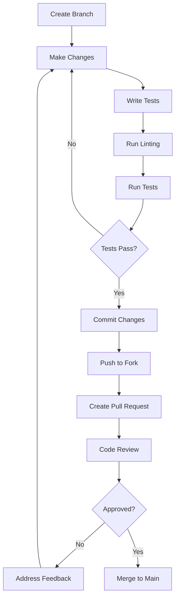

# Contribution Guidelines

## Overview

We welcome contributions to the AI Chatbot project! This document outlines the process for contributing code, reporting issues, and helping improve the project. By following these guidelines, you help maintain code quality and ensure a smooth collaboration experience.

## Getting Started

### Prerequisites

Before contributing, make sure you have:

- [ ] Completed the [Local Development Setup](./04-local-development-setup.md)
- [ ] Read the [Project Architecture](./02-project-architecture.md) documentation
- [ ] Familiarized yourself with [Key Technologies](./05-key-technologies-and-concepts.md)
- [ ] A GitHub account for submitting pull requests

### Development Environment

Ensure your development environment is properly configured:

```bash
# Verify Node.js version (18.17+)
node --version

# Verify pnpm installation
pnpm --version

# Install dependencies
pnpm install

# Run development server
pnpm dev

# Run tests
pnpm test
```

## Contribution Workflow

### 1. Fork and Clone

```bash
# Fork the repository on GitHub
# Then clone your fork
git clone https://github.com/YOUR_USERNAME/ai-chatbot.git
cd ai-chatbot

# Add upstream remote
git remote add upstream https://github.com/vercel/ai-chatbot.git
```

### 2. Create a Feature Branch

```bash
# Create and switch to a new branch
git checkout -b feature/your-feature-name

# Or for bug fixes
git checkout -b fix/issue-description

# Or for documentation
git checkout -b docs/documentation-update
```

### Branch Naming Conventions

- `feature/` - New features or enhancements
- `fix/` - Bug fixes
- `docs/` - Documentation updates
- `refactor/` - Code refactoring
- `test/` - Adding or updating tests
- `chore/` - Maintenance tasks

### 3. Development Process



### 4. Making Changes

#### Code Quality Standards

Run these commands before committing:

```bash
# Format code
pnpm format

# Fix linting issues
pnpm lint:fix

# Run type checking
pnpm build

# Run tests
pnpm test
```

#### Writing Tests

All new features should include tests:

```typescript
// tests/e2e/new-feature.test.ts
import { test, expect } from "@playwright/test";

test.describe("New Feature", () => {
  test("should work correctly", async ({ page }) => {
    await page.goto("/feature-page");

    // Test your feature
    await page.click('[data-testid="feature-button"]');
    await expect(page.locator('[data-testid="result"]')).toBeVisible();
  });
});
```

#### Component Testing

```typescript
// components/__tests__/MyComponent.test.tsx
import { render, screen } from "@testing-library/react";
import { MyComponent } from "../MyComponent";

describe("MyComponent", () => {
  it("renders correctly", () => {
    render(<MyComponent title="Test" />);
    expect(screen.getByText("Test")).toBeInTheDocument();
  });
});
```

### 5. Commit Guidelines

#### Commit Message Format

We follow the [Conventional Commits](https://www.conventionalcommits.org/) specification:

```bash
<type>[optional scope]: <description>

[optional body]

[optional footer(s)]
```

#### Commit Types

- `feat:` - New features
- `fix:` - Bug fixes
- `docs:` - Documentation changes
- `style:` - Code style changes (formatting, etc.)
- `refactor:` - Code refactoring
- `test:` - Adding or updating tests
- `chore:` - Maintenance tasks

#### Examples

```bash
# Good commit messages
feat(chat): add message streaming functionality
fix(auth): resolve login redirect issue
docs(readme): update installation instructions
refactor(components): extract reusable button component
test(api): add tests for chat endpoint

# Bad commit messages
fix bug
update code
changes
```

### 6. Pull Request Process

#### Creating a Pull Request

1. **Push your branch**:

   ```bash
   git push origin feature/your-feature-name
   ```

2. **Create PR on GitHub**:
   - Go to your fork on GitHub
   - Click "New Pull Request"
   - Select your feature branch
   - Fill out the PR template

#### Pull Request Template

```markdown
## Description

Brief description of changes made.

## Type of Change

- [ ] Bug fix (non-breaking change which fixes an issue)
- [ ] New feature (non-breaking change which adds functionality)
- [ ] Breaking change (fix or feature that would cause existing functionality to not work as expected)
- [ ] Documentation update

## Testing

- [ ] Tests pass locally
- [ ] Added tests for new functionality
- [ ] Manual testing completed

## Screenshots (if applicable)

Add screenshots to help explain your changes.

## Checklist

- [ ] My code follows the project's style guidelines
- [ ] I have performed a self-review of my code
- [ ] I have commented my code, particularly in hard-to-understand areas
- [ ] I have made corresponding changes to the documentation
- [ ] My changes generate no new warnings
- [ ] I have added tests that prove my fix is effective or that my feature works
```

#### Review Process

1. **Automated Checks**: CI/CD pipeline runs automatically
2. **Code Review**: Maintainers review your code
3. **Feedback**: Address any requested changes
4. **Approval**: Once approved, your PR will be merged

## Code Style Guidelines

### TypeScript Standards

```typescript
// Use explicit types for function parameters and return values
export async function createChat(userId: string, title: string): Promise<Chat> {
  return await db
    .insert(chat)
    .values({
      userId,
      title,
      createdAt: new Date(),
    })
    .returning();
}

// Use proper error handling
try {
  const result = await apiCall();
  return result;
} catch (error) {
  console.error("API call failed:", error);
  throw new Error("Failed to process request");
}
```

### React Component Standards

```typescript
// Use proper TypeScript interfaces
interface ChatMessageProps {
  message: Message;
  onEdit?: (id: string) => void;
  className?: string;
}

// Use forwardRef for components that need refs
export const ChatMessage = React.forwardRef<HTMLDivElement, ChatMessageProps>(
  ({ message, onEdit, className }, ref) => {
    return (
      <div ref={ref} className={cn("message", className)}>
        {message.content}
      </div>
    );
  }
);

ChatMessage.displayName = "ChatMessage";
```

### CSS/Styling Standards

```typescript
// Use Tailwind classes with proper organization
<div className={cn(
  // Layout
  'flex items-center justify-between',
  // Spacing
  'p-4 m-2',
  // Colors
  'bg-background text-foreground',
  // States
  'hover:bg-accent focus:ring-2',
  // Responsive
  'md:p-6 lg:p-8',
  // Custom classes
  className
)}>
```

## Database Changes

### Schema Modifications

When modifying the database schema:

1. **Create Migration**:

   ```bash
   # Make changes to lib/db/schema.ts
   pnpm db:generate
   ```

2. **Test Migration**:

   ```bash
   # Test on local database
   pnpm db:migrate

   # Verify with Drizzle Studio
   pnpm db:studio
   ```

3. **Document Changes**:
   ```typescript
   // Add comments to schema changes
   export const newTable = pgTable("NewTable", {
     id: uuid("id").primaryKey().defaultRandom(),
     // Added in v2.1.0 for feature XYZ
     newField: text("new_field").notNull(),
   });
   ```

## API Changes

### Adding New Endpoints

```typescript
// app/api/new-endpoint/route.ts
import { auth } from "@/app/(auth)/auth";
import { NextRequest, NextResponse } from "next/server";
import { z } from "zod";

// Define request schema
const requestSchema = z.object({
  param1: z.string(),
  param2: z.number().optional(),
});

export async function POST(request: NextRequest) {
  try {
    // Authenticate user
    const session = await auth();
    if (!session?.user) {
      return NextResponse.json({ error: "Unauthorized" }, { status: 401 });
    }

    // Validate request body
    const body = await request.json();
    const { param1, param2 } = requestSchema.parse(body);

    // Process request
    const result = await processRequest(param1, param2);

    return NextResponse.json({ result });
  } catch (error) {
    console.error("API error:", error);
    return NextResponse.json(
      { error: "Internal server error" },
      { status: 500 }
    );
  }
}
```

## Testing Guidelines

### Test Categories

1. **Unit Tests**: Test individual functions and components
2. **Integration Tests**: Test API endpoints and database operations
3. **End-to-End Tests**: Test complete user workflows

### Writing Good Tests

```typescript
// Good test structure
describe("ChatService", () => {
  beforeEach(() => {
    // Setup test data
  });

  afterEach(() => {
    // Cleanup
  });

  describe("createChat", () => {
    it("should create a new chat with valid data", async () => {
      // Arrange
      const userId = "user-123";
      const title = "Test Chat";

      // Act
      const chat = await createChat(userId, title);

      // Assert
      expect(chat).toBeDefined();
      expect(chat.title).toBe(title);
      expect(chat.userId).toBe(userId);
    });

    it("should throw error with invalid data", async () => {
      // Arrange
      const invalidUserId = "";
      const title = "Test Chat";

      // Act & Assert
      await expect(createChat(invalidUserId, title)).rejects.toThrow();
    });
  });
});
```

## Documentation Standards

### Code Documentation

````typescript
/**
 * Creates a new chat for the specified user.
 *
 * @param userId - The ID of the user creating the chat
 * @param title - The title of the chat
 * @param options - Optional configuration
 * @returns Promise that resolves to the created chat
 *
 * @example
 * ```typescript
 * const chat = await createChat('user-123', 'My Chat')
 * console.log(chat.id) // 'chat-456'
 * ```
 */
export async function createChat(
  userId: string,
  title: string,
  options?: ChatOptions
): Promise<Chat> {
  // Implementation
}
````

### README Updates

When adding new features, update relevant documentation:

- Update feature lists
- Add configuration examples
- Include usage instructions
- Update screenshots if needed

## Issue Reporting

### Bug Reports

Use the bug report template:

```markdown
**Describe the bug**
A clear and concise description of what the bug is.

**To Reproduce**
Steps to reproduce the behavior:

1. Go to '...'
2. Click on '....'
3. Scroll down to '....'
4. See error

**Expected behavior**
A clear and concise description of what you expected to happen.

**Screenshots**
If applicable, add screenshots to help explain your problem.

**Environment:**

- OS: [e.g. macOS, Windows, Linux]
- Browser: [e.g. Chrome, Firefox, Safari]
- Node.js version: [e.g. 18.17.0]
- Project version: [e.g. 3.0.23]

**Additional context**
Add any other context about the problem here.
```

### Feature Requests

Use the feature request template:

```markdown
**Is your feature request related to a problem?**
A clear and concise description of what the problem is.

**Describe the solution you'd like**
A clear and concise description of what you want to happen.

**Describe alternatives you've considered**
A clear and concise description of any alternative solutions or features you've considered.

**Additional context**
Add any other context or screenshots about the feature request here.
```

## Community Guidelines

### Code of Conduct

- Be respectful and inclusive
- Provide constructive feedback
- Help others learn and grow
- Follow the project's coding standards
- Respect maintainers' time and decisions

### Communication

- Use clear, descriptive titles for issues and PRs
- Provide sufficient context and examples
- Be patient with review processes
- Ask questions if something is unclear
- Share knowledge and help other contributors

## Release Process

### Versioning

We follow [Semantic Versioning](https://semver.org/):

- **MAJOR**: Breaking changes
- **MINOR**: New features (backward compatible)
- **PATCH**: Bug fixes (backward compatible)

### Release Notes

When contributing to releases:

```markdown
## [3.1.0] - 2024-01-15

### Added

- New chat streaming functionality
- Support for multiple AI providers
- File upload capabilities

### Changed

- Improved authentication flow
- Updated UI components

### Fixed

- Fixed message ordering issue
- Resolved database connection problems

### Deprecated

- Old message format (will be removed in v4.0.0)
```

## Getting Help

### Resources

- [Project Documentation](./)
- [GitHub Discussions](https://github.com/vercel/ai-chatbot/discussions)
- [Discord Community](https://discord.gg/vercel)
- [Stack Overflow](https://stackoverflow.com/questions/tagged/vercel-ai-sdk)

### Mentorship

New contributors can:

- Look for "good first issue" labels
- Ask questions in discussions
- Join community calls
- Pair program with maintainers

## Recognition

Contributors are recognized through:

- GitHub contributor graphs
- Release notes mentions
- Community highlights
- Maintainer nominations

Thank you for contributing to the AI Chatbot project! Your contributions help make this project better for everyone. 🙏

## Next Steps

Now that you understand the contribution process:

1. Find an issue to work on or propose a new feature
2. Set up your development environment
3. Make your first contribution
4. Join the community discussions

Happy contributing! 🚀
