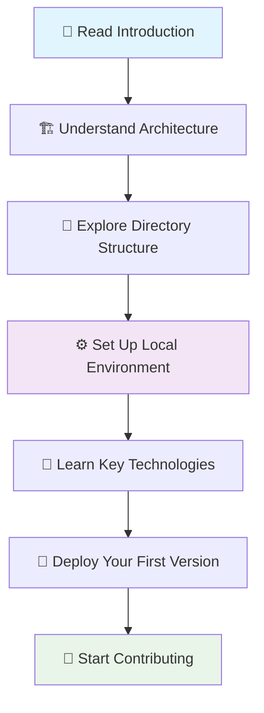

# AI Chatbot Documentation

Welcome to the comprehensive onboarding documentation for the AI Chatbot project! This documentation is designed to help new developers understand, set up, and contribute to the project effectively.

## 📚 Documentation Overview

This documentation is organized into seven main sections, each building upon the previous one to provide a complete understanding of the project:

### 1. [Introduction](./01-introduction.md)

**Start here!** Get a high-level overview of what the AI Chatbot is, its key features, and who it's designed for.

- Project overview and goals
- Key features and capabilities
- Target audience and use cases
- Technology stack overview

### 2. [Project Architecture](./02-project-architecture.md)

Understand the system design and how different components work together.

- High-level architecture diagrams
- Component relationships
- Data flow patterns
- Database schema design
- Security architecture

### 3. [Directory Structure](./03-directory-structure.md)

Navigate the codebase with confidence by understanding how files and folders are organized.

- Complete directory breakdown
- File naming conventions
- Import patterns and best practices
- Component organization

### 4. [Local Development Setup](./04-local-development-setup.md)

Get your development environment up and running quickly.

- Prerequisites and requirements
- Step-by-step setup instructions
- Environment variable configuration
- Database setup options
- Troubleshooting common issues

### 5. [Key Technologies and Concepts](./05-key-technologies-and-concepts.md)

Deep dive into the core technologies that power the application.

- Next.js App Router and React Server Components
- Vercel AI SDK integration
- Database management with Drizzle ORM
- Authentication with NextAuth.js
- UI components and styling
- TypeScript best practices

### 6. [Deployment](./06-deployment.md)

Learn how to deploy your application to production.

- Vercel deployment (recommended)
- Environment setup for production
- Database and storage configuration
- Custom domain setup
- Performance optimization
- Alternative deployment options

### 7. [Contribution Guidelines](./07-contribution-guidelines.md)

Understand how to contribute to the project effectively.

- Development workflow
- Code style guidelines
- Testing requirements
- Pull request process
- Issue reporting
- Community guidelines

## 🚀 Quick Start Guide

New to the project? Follow this path:

### For Different Roles

**👨‍💻 Developers**

1. [Introduction](./01-introduction.md) → [Local Development Setup](./04-local-development-setup.md) → [Key Technologies](./05-key-technologies-and-concepts.md)

**🏗️ Architects**

1. [Project Architecture](./02-project-architecture.md) → [Directory Structure](./03-directory-structure.md) → [Key Technologies](./05-key-technologies-and-concepts.md)

**🚀 DevOps Engineers**

1. [Introduction](./01-introduction.md) → [Deployment](./06-deployment.md) → [Local Development Setup](./04-local-development-setup.md)

**🤝 Contributors**

1. [Introduction](./01-introduction.md) → [Local Development Setup](./04-local-development-setup.md) → [Contribution Guidelines](./07-contribution-guidelines.md)

## 📋 Prerequisites Checklist

Before diving into the documentation, ensure you have:

- [ ] Basic knowledge of React and TypeScript
- [ ] Familiarity with Next.js (helpful but not required)
- [ ] Understanding of database concepts
- [ ] Git and GitHub experience
- [ ] Node.js 18.17+ installed
- [ ] A code editor (VS Code recommended)

## 🎯 Learning Objectives

After completing this documentation, you will be able to:

- [ ] Understand the overall architecture and design decisions
- [ ] Set up a complete local development environment
- [ ] Navigate the codebase confidently
- [ ] Implement new features following project conventions
- [ ] Deploy the application to production
- [ ] Contribute effectively to the project
- [ ] Troubleshoot common issues independently

## 🛠️ Development Tools

The project uses several tools to maintain code quality and developer experience:

| Tool             | Purpose              | Configuration                                        |
| ---------------- | -------------------- | ---------------------------------------------------- |
| **TypeScript**   | Type safety          | [`tsconfig.json`](../../tsconfig.json)               |
| **ESLint**       | Code linting         | [`.eslintrc.json`](../../.eslintrc.json)             |
| **Biome**        | Formatting & linting | [`biome.jsonc`](../../biome.jsonc)                   |
| **Playwright**   | E2E testing          | [`playwright.config.ts`](../../playwright.config.ts) |
| **Drizzle**      | Database ORM         | [`drizzle.config.ts`](../../drizzle.config.ts)       |
| **Tailwind CSS** | Styling              | [`tailwind.config.ts`](../../tailwind.config.ts)     |

## 🔗 External Resources

### Official Documentation

- [Next.js Documentation](https://nextjs.org/docs)
- [Vercel AI SDK](https://sdk.vercel.ai/docs)
- [Drizzle ORM](https://orm.drizzle.team/)
- [NextAuth.js](https://authjs.dev/)
- [Tailwind CSS](https://tailwindcss.com/docs)
- [shadcn/ui](https://ui.shadcn.com/)

### Community Resources

- [GitHub Repository](https://github.com/vercel/ai-chatbot)
- [GitHub Discussions](https://github.com/vercel/ai-chatbot/discussions)
- [Vercel Community](https://vercel.com/community)
- [Next.js Discord](https://discord.gg/nextjs)

### Learning Resources

- [React Documentation](https://react.dev/)
- [TypeScript Handbook](https://www.typescriptlang.org/docs/)
- [PostgreSQL Tutorial](https://www.postgresql.org/docs/current/tutorial.html)
- [AI SDK Examples](https://github.com/vercel/ai/tree/main/examples)

## 🆘 Getting Help

If you encounter issues or have questions:

1. **Check the documentation** - Most common questions are answered here
2. **Search existing issues** - Someone might have faced the same problem
3. **Ask in discussions** - Community members are helpful
4. **Create an issue** - For bugs or feature requests
5. **Join the community** - Discord and other channels

### Common Issues and Solutions

| Issue                      | Solution                                       |
| -------------------------- | ---------------------------------------------- |
| Port 3000 in use           | Kill process: `lsof -ti:3000 \| xargs kill -9` |
| Database connection failed | Check `POSTGRES_URL` in `.env.local`           |
| AI API errors              | Verify API key and credits                     |
| Build failures             | Clear cache: `rm -rf .next && pnpm install`    |
| Type errors                | Run `pnpm build` to see detailed errors        |

## 📈 Project Status

This documentation covers version **3.0.23** of the AI Chatbot project. The project is actively maintained and regularly updated with new features and improvements.

### Recent Updates

- ✅ Next.js 15 with App Router
- ✅ React 19 support
- ✅ Enhanced AI SDK integration
- ✅ Improved authentication flow
- ✅ Better TypeScript support

### Upcoming Features

- 🔄 Enhanced artifact system
- 🔄 Multi-modal AI capabilities
- 🔄 Advanced collaboration features
- 🔄 Performance optimizations

## 🤝 Contributing to Documentation

Found an error or want to improve the documentation? We welcome contributions!

### How to Contribute

1. Fork the repository
2. Create a branch: `git checkout -b docs/improvement-description`
3. Make your changes
4. Test the documentation locally
5. Submit a pull request

### Documentation Standards

- Use clear, concise language
- Include code examples where helpful
- Add diagrams for complex concepts
- Keep information up-to-date
- Follow the existing structure and style

## 📝 Feedback

Your feedback helps us improve this documentation. Please let us know:

- What sections were most helpful?
- What information was missing?
- Which parts were confusing?
- How can we make it better?

You can provide feedback through:

- [GitHub Issues](https://github.com/vercel/ai-chatbot/issues)
- [GitHub Discussions](https://github.com/vercel/ai-chatbot/discussions)
- Pull requests with improvements

## 🎉 Welcome to the Community!

Thank you for your interest in the AI Chatbot project! We're excited to have you as part of our community. Whether you're here to learn, contribute, or build something amazing, we're here to support your journey.

Happy coding! 🚀

---

**Next Steps**: Start with the [Introduction](./01-introduction.md) to begin your journey with the AI Chatbot project.
