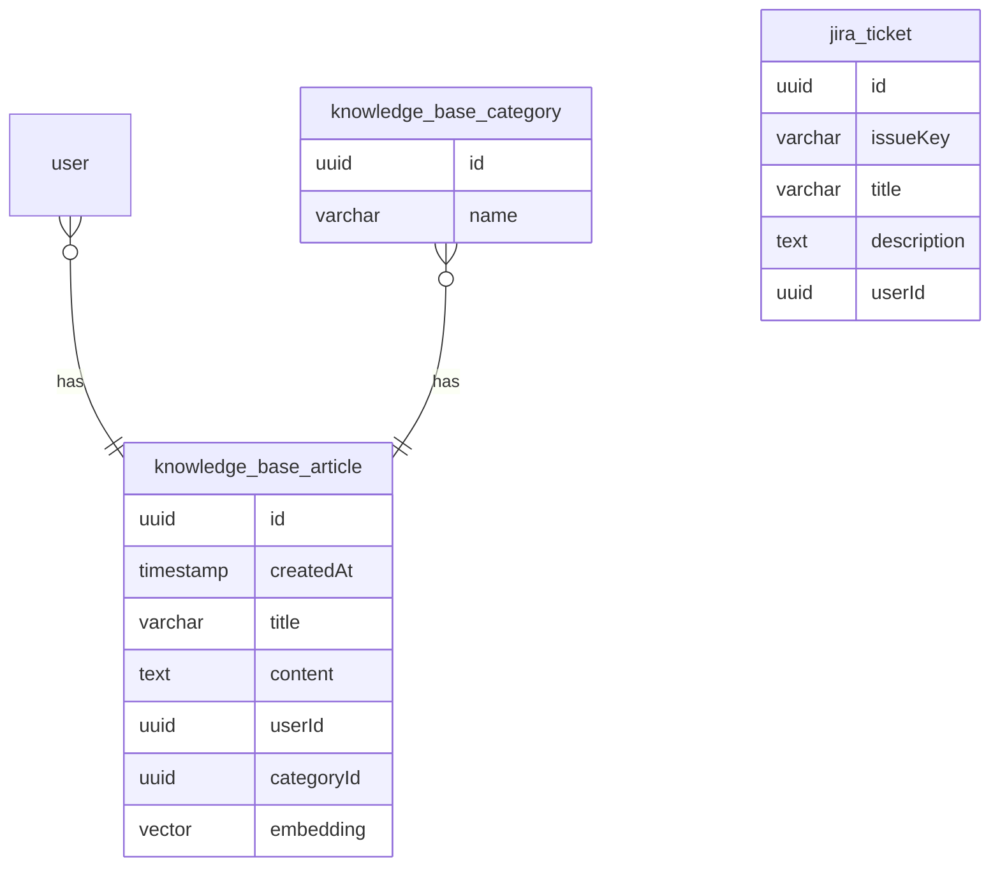

# Production Support Extension: Implementation Plan

## 1. Current State Assessment

**What Exists:**

- **Database:** A robust schema with tables for `users`, `chats`, `messages`, and `documents`. The `document` table is a good starting point for KB articles.
- **Server Actions:** A clear and concise pattern for handling client-side requests in `app/(chat)/actions.ts`.
- **AI Tools:** An extensible, handler-based architecture for AI tools in `lib/ai/tools/`, as seen with `create-document.ts`.
- **UI Components:** A comprehensive set of React components in the `components/` directory, including a sidebar (`app-sidebar.tsx`) and document rendering components (`document.tsx`).

**What Needs to be Added:**

- **Knowledge Base Schema:** New tables to store Knowledge Base articles, categories, and importantly, vector embeddings for search.
- **Jira Integration:** A new schema and services to handle Jira ticket creation and management.
- **KB Management UI:** A new set of UI components for creating, editing, and managing Knowledge Base articles.
- **Vector Search Service:** A service layer to perform vector similarity searches on the Knowledge Base.
- **New AI Tools:** AI tools for searching the Knowledge Base and creating Jira tickets.
- **API Endpoints:** New API routes to support the KB management UI.

## 2. Database Migration Strategy

I will extend the existing database schema using `drizzle-orm`.

**Migration Steps:**

1.  **Define New Schemas:** Create new schema definitions in a new file, `lib/db/kb-schema.ts`, for `knowledge_base_article`, `knowledge_base_category`, and `jira_ticket`. The `knowledge_base_article` table will include a `vector` column for `pgvector`.
2.  **Generate Migration:** Use `drizzle-kit` to generate a new SQL migration file.
3.  **Apply Migration:** The existing migration script at `lib/db/migrate.ts` will be used to apply the changes.

## 3. Architecture Integration Plan

**Dual Interface (Chat + KB Management):**

- **Routing:** The KB Management UI will live under a new route, `/kb`.
- **Navigation:** I will add a new navigation link to the `app-sidebar.tsx` component to switch between the Chat and KB Management interfaces.

**Backend Integration:**

- **Server Actions:** New server actions will be created for KB and Jira operations, following the existing pattern.
- **API Routes:** New API endpoints will be created under `app/api/kb/` to handle CRUD operations for Knowledge Base articles.
- **AI Tools:**
  - A new `search_knowledge_base` tool will be created. This tool will take a user's query, generate an embedding, and use `pgvector` to find relevant articles.
  - A new `create_jira_ticket` tool will be created to allow the chatbot to create Jira tickets.

## 4. Implementation Roadmap (Phase 1)

**Phase 1: Knowledge Base Foundation**

1.  **Schema & Migration:**
    - [ ] Define `knowledge_base_article` and `knowledge_base_category` schemas.
    - [ ] Generate and apply the database migration.
2.  **Backend Services:**
    - [ ] Create `lib/db/kb-queries.ts` with functions for CRUD operations on KB articles.
    - [ ] Implement a service to generate vector embeddings for KB articles using an embedding model.
3.  **UI - KB Management:**
    - [ ] Create a new page at `/kb` for the KB Management UI.
    - [ ] Build a simple UI to list, create, and edit KB articles. Reuse existing components from `components/ui/` where possible.
4.  **AI - Vector Search:**
    - [ ] Implement the `search_knowledge_base` AI tool.
    - [ ] Integrate the tool with the main chat flow so the chatbot can answer questions using the KB.

## 5. Risk Assessment

- **Schema Changes:** Modifying the database schema always carries a risk. I will mitigate this by thoroughly testing the migration on a staging environment before deploying to production.
- **Performance:** Vector search can be resource-intensive. I will need to monitor the performance of the Vercel Postgres instance and optimize queries as needed.
- **Third-Party Dependencies:** The Jira integration introduces a dependency on the Jira API. I will need to handle potential API outages or changes gracefully.
